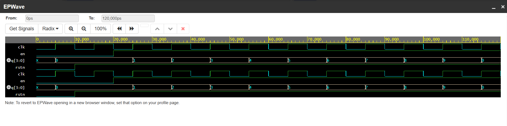

# Verilog Mod-10 Counter

## Description

A 4-bit counter that counts from 0 to 9 and resets to 0.

---

## Inputs

* clk : clock signal
* rstn : active-low reset
* en : enable signal

---

## Output

* q[3:0] : counter value

---

## Behavior

* Reset when rstn = 0
* Count increases when en = 1
* Hold value when en = 0
* Counter wraps from 9 → 0

---

## Waveform

